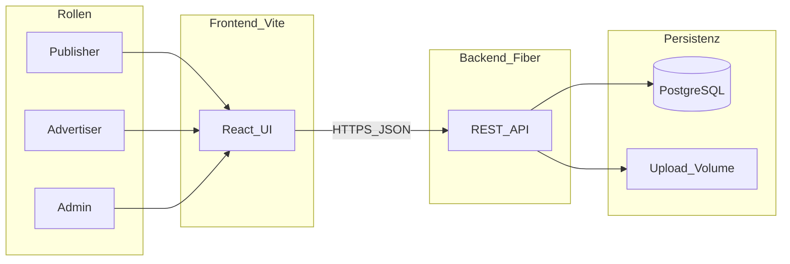

# NBA Dashboard

Webplattform für den **Austausch und die Bearbeitung von Nachbuchungs-Dateien** (CSV/XLSX) zwischen **Publishern**, **Advertisern** und **Admins**: Upload, Zuweisung, Status-Workflow, optionale Validierung gegen eine Netzwerk-API, Kampagnen-Synchronisation und Exporte. Frontend und Backend sind getrennt; die API liegt unter dem Präfix `/api`.

## Rollen und Oberflächen

| Rolle | Nach Login | Kurzbeschreibung |
|--------|--------------|------------------|
| `publisher` | `/dashboard` | Dateien hochladen, eigene Uploads einsehen, abschließen |
| `advertiser` | `/advertiser-dashboard` | Zugewiesene Dateien bearbeiten, Feedback, Rückgabe an Publisher |
| `admin` | `/admin-dashboard` | Alle Uploads, Advertiser-Zuweisung, Validierung/Admin-Flows |
| `pending` | `/complete-profile` | Profil nach OAuth/Registrierung vervollständigen |

Geschützte Routen und Weiterleitungen: [`src/App.tsx`](src/App.tsx), [`src/components/ProtectedRoute.tsx`](src/components/ProtectedRoute.tsx).

## Typischer Ablauf



## Funktionsüberblick

- **Authentifizierung**: Login, Registrierung (Publisher/Advertiser), Google Sign-In, Passwort vergessen/zurücksetzen, Session-Token (JWT), Profil vervollständigen, Avatar (Upload/GET/DELETE). API unter `/api/auth/*`; für Abwärtskompatibilität existiert zusätzlich `POST /api/login`.
- **Uploads**: Hochladen, Liste je Rolle, Download, Ersetzen, Löschen, Status (u. a. Freigabe/Ablehnung durch Admin, Abschluss durch Publisher), Zugriff für Advertiser, Rückgabe an Publisher.
- **In-App-Bearbeitung**: Tabellenartige Inhalte lesen/schreiben über `/api/uploads/:id/content` (Excel/CSV über Backend-Library).
- **Validierung**: Admin-Preview und gespeicherte Ergebnisse (`/validate`, `/validation`, `/validations`); optional Anbindung an eine externe Orders-/Netzwerk-API (`NETWORK_API_*` im Backend).
- **Nachbuchungen / Export**: CSV-Exporte mit Versionierung (`/api/uploads/:id/bookings/csv`, Download über `/api/bookings/csv-exports/:exportId/download`).
- **Kampagnen-Sync**: Hintergrund-Scheduler cached Kampagnen-/Order-Daten; Status und manueller Sync (`/api/campaigns/...`), Monitoring-Endpunkt für den Scheduler.

Detaillierte Architekturdiagramme, Datenmodell und Beispiel-Requests: [`DocRead.me`](DocRead.me).

## Technologie-Stack

| Schicht | Technologien |
|---------|----------------|
| Frontend | React 18, TypeScript, Vite 5, Tailwind CSS, shadcn/ui (Radix), TanStack Query, React Router, Axios, Zod/React Hook Form |
| Backend | Go 1.24.x, Fiber, GORM, PostgreSQL, JWT (golang-jwt), bcrypt |
| Qualität / CI | ESLint, `go test`, `go vet`, `gofmt` (siehe Workflows) |

## Repository-Struktur

```
NBA-Dashboard/
├── src/                    # React-Frontend (Seiten, Komponenten, services/)
├── go-backend/
│   ├── cmd/main.go         # HTTP-Server, Routen, Middleware
│   ├── internal/           # handlers, models, config, services, lib
│   └── uploads/            # lokale Upload-Dateien (nicht committen)
├── public/                 # statische Assets
├── scripts/                # Hilfsskripte (z. B. Backend-Dev, Deploy)
├── docker-compose.yml      # lokale PostgreSQL-Instanz
├── Dockerfile              # Frontend-Produktions-Image
├── go-backend/Dockerfile   # Backend-Image
├── compose.prod.yml        # Produktion (Traefik, GHCR-Images, Secrets)
├── compose.staging.yml     # Staging
├── compose.traefik.yml     # Edge-Routing (Traefik)
├── .github/workflows/      # ci.yml, release.yml
├── PROD_RUNBOOK.md
├── GO_LIVE_CHECKLIST.md
├── DB_SYNC_DOKU.md
└── DocRead.me              # technische Tiefendoku
```

## Lokaler Quickstart

### Voraussetzungen

- Node.js 20 LTS (wie in CI)
- npm
- Go 1.24.x
- Docker (nur für PostgreSQL lokal)

### 1. Datenbank

Im Projektroot:

```bash
docker compose up -d
```

Standard aus [`docker-compose.yml`](docker-compose.yml): PostgreSQL 15, Port **5432**, Datenbank `nba_dashboard`, User `nba_user`, Passwort `nba_pass` (nur für lokale Entwicklung).

### 2. Backend

```bash
cd go-backend
cp .env.example .env
# DB_HOST, DB_USER, DB_PASSWORD, DB_NAME, JWT_SECRET anpassen
go mod download
go run cmd/main.go
```

Alternativ vom Root: `npm run dev:backend` (startet [`scripts/start-backend-dev.sh`](scripts/start-backend-dev.sh) auf Port 3001, falls noch frei).

Standard-API-Port: **3001** (konfigurierbar über `PORT`).

### 3. Frontend

Im Projektroot:

```bash
cp .env.example .env
npm ci
npm run dev
```

Der Vite-Dev-Server lauscht auf **Port 8080** (siehe [`vite.config.ts`](vite.config.ts)). Axios sendet relative Pfade wie `/uploads` an `VITE_API_BASE_URL`; die Backend-Routen hängen unter **`/api`**.

Empfohlene lokale API-Base-URL **mit** Vite-Proxy:

```env
VITE_API_BASE_URL=http://localhost:8080/api
```

So gehen Browser-Requests an `http://localhost:8080/api/...` und der Proxy leitet an `http://localhost:3001/api/...` weiter.

Alternative ohne Proxy (direkt zum Backend):

```env
VITE_API_BASE_URL=http://localhost:3001/api
```

Dann muss CORS im Backend passend zu deiner Frontend-Origin konfiguriert sein (`CORS_ALLOW_ORIGINS`).

Google Sign-In (optional): `VITE_GOOGLE_CLIENT_ID`, `VITE_GOOGLE_ALLOWED_ORIGINS` – siehe [`.env.example`](.env.example).

## Konfiguration (Auszug)

### Frontend ([`.env.example`](.env.example))

| Variable | Bedeutung |
|----------|-----------|
| `VITE_API_BASE_URL` | Basis-URL inkl. `/api` (siehe Quickstart) |
| `VITE_GOOGLE_CLIENT_ID` | Google OAuth Client (optional) |
| `VITE_GOOGLE_ALLOWED_ORIGINS` | Komma-getrennte Origins für GSI |

### Backend ([`go-backend/.env.example`](go-backend/.env.example))

| Bereich | Variablen (Auszug) |
|---------|---------------------|
| Laufzeit | `APP_ENV`, `PORT` |
| Datenbank | `DB_HOST`, `DB_PORT`, `DB_USER`, `DB_PASSWORD`, `DB_NAME`, `DB_SSLMODE`, `DB_AUTO_MIGRATE` |
| Sicherheit | `JWT_SECRET` (Pflicht in Production), `CORS_ALLOW_ORIGINS` (Pflicht wenn `APP_ENV=production`) |
| Observability | `LOG_FORMAT`, Security-Header, Rate-Limits (`RATE_LIMIT_*`, `AUTH_RATE_LIMIT_*`) |
| Uploads / Avatare | `UPLOAD_*`, `AVATAR_*` |
| Netzwerk-API / Validierung | `NETWORK_API_BASE_URL`, `NETWORK_API_TOKEN`, `NETWORK_API_URL` |
| Kampagnen-Sync | `CAMPAIGN_SYNC_*`, `VALIDATION_DB_CACHE_ENABLED` |
| Secrets in Containern | `JWT_SECRET_FILE`, `DB_PASSWORD_FILE`, `NETWORK_API_TOKEN_FILE` (siehe `hydrateEnvFromSecretFiles` in [`go-backend/cmd/main.go`](go-backend/cmd/main.go)) |

Healthchecks (ohne `/api`-Präfix): `GET /health`, `GET /ready` (DB-Ping).

## Build

```bash
npm run build          # Frontend -> dist/
cd go-backend && go build -o app ./cmd
```

## Deployment und CI/CD

- **CI** ([`.github/workflows/ci.yml`](.github/workflows/ci.yml)): Frontend `npm ci` + `npm run build`; Backend `gofmt`, `go vet`, `go test`, `go build`. Auf Push nach `main`: Build und Push von `ghcr.io/<owner>/nba-backend` und `nba-frontend` (Build-Args u. a. `VITE_API_BASE_URL` für Production-Image).
- **Release** ([`.github/workflows/release.yml`](.github/workflows/release.yml)): Tag `v*` löst Release-Checks aus, lädt Artefakte `frontend-dist` und `backend-binary` hoch; Job `deploy-production` kopiert Compose-Dateien per SSH und startet Stack (Podman, GHCR-Pull, Smoke-Tests gegen `/health` und `/ready`).

Compose-Beispiele mit Traefik und externen Docker-Secrets: [`compose.prod.yml`](compose.prod.yml), [`compose.staging.yml`](compose.staging.yml).

## Betrieb und Go-Live

- [`PROD_RUNBOOK.md`](PROD_RUNBOOK.md) – Betrieb, Smoke-Tests, Rollback
- [`GO_LIVE_CHECKLIST.md`](GO_LIVE_CHECKLIST.md) – formale Freigabe-Checkliste
- [`DB_SYNC_DOKU.md`](DB_SYNC_DOKU.md) – DB/Sync/Monitoring

## Weiterführende Dokumentation

- [`DocRead.me`](DocRead.me) – Architektur (Mermaid), Datenmodell, API-Beispiele

## Beitragen

1. Feature-Branch von `main`
2. Änderungen committen
3. Pull Request; CI soll grün sein (Job `Frontend Build and Lint`: `npm run build` blockiert bei Fehler; `npm run lint` ist im Workflow vorübergehend `continue-on-error`)

## Lizenz und Urheber

Internes Projekt der **uppr GmbH**. Nutzung und Weitergabe nur nach interner Freigabe.

---

*README-Stand abgestimmt mit Backend-Routen in `go-backend/cmd/main.go` und Frontend-Routing in `src/App.tsx`.*
